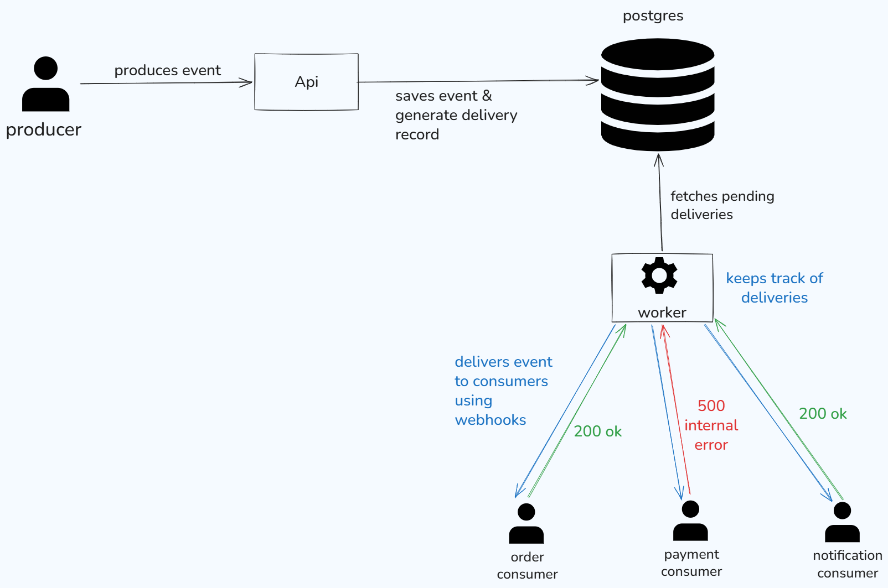

# EventFlow

EventFlow is a high-throughput event processing system that sits between event producers and consumers.

A producer sends an event to EventFlow, and EventFlow takes care of storing it, processing it asynchronously, and delivering it to the consumers that are interested in that event.

## Problem

In a microservice architecture, one service often needs to notify multiple other services when something happens.

For example, when an order is created, several services might need to react to it:

- An inventory service may need to reserve the items.
- A payment service may need to process the payment.
- A notification service may need to notify the customer.

If the producer has to directly communicate with all of these services, it starts becoming responsible for things that are outside its core responsibility.

It now needs to know:

- Which services consume the event?
- Where are those services?
- Are they currently available?
- What happens if a consumer fails?
- Should the request be retried?
- How many times should it be retried?
- Should the producer wait for the consumers to finish?

This creates tighter coupling between the producer and its consumers and can also make the producer responsible for handling failures and delivery logic.

## Solution

EventFlow acts as a layer between producers and consumers.

Instead of a producer communicating directly with every consumer, it simply sends the event to EventFlow.

EventFlow then takes responsibility for:

- Persisting the event
- Identifying the consumers interested in that event
- Creating deliveries for those consumers
- Processing deliveries asynchronously
- Tracking delivery status
- Retrying failed deliveries

This allows the producer to finish its work without having to know how or where the event will eventually be consumed.

## The Goal

The idea behind EventFlow is simple:

> **The producer should produce the event. EventFlow should take care of what happens after that.**

The producer shouldn't have to worry about:

- Who consumes the event?
- Where are the consumers?
- Are they currently available?
- Did they successfully process the event?
- Should the delivery be retried?
- What happens if a consumer is temporarily unavailable?
- How many times should a failed delivery be retried?
- Should the producer wait for consumers to finish?

These are the responsibilities that EventFlow is designed to handle.

## Architecture



## Performance

EventFlow's ingestion API was benchmarked using [k6](https://grafana.com) with 10 concurrent virtual users.

### Ingestion Benchmark

| Metric | Result |
|---|---:|
| Event ingestion | 1652.76 req/sec |
| API p90 latency | 8.35 ms |
| API p95 latency | 9.77 ms |
| API maximum latency | 892.96 ms |
| Success rate | 100% |
| Median latency | 4.91% |
| Virtual users | 10 |

Summary 

This test was conducted in docker environment with 10 virtual users for 30 seconds.
> Note: This benchmarks measure the ingestion performance of EventFlow. It does not represent end-to-end webhook delivery throughput
> [View the complete benchmark methodology and results ->](benchmarks/README.md)


### Tasks
- [x] write get and post method for an event
- [x] add postgres database using docker
- [x] add worker to process the events
- [x] ensure worker delivers event to the consumer ✅
- [x] complete the most basic flow of the app
- [x] test ingestion for api
- [x] test average latency of event delivery
- [ ] migrate worker from sequential to concurrent delivery events


## Getting Started

### Prerequisites

Make sure you have the following installed:

* [`.NET SDK`](https://dotnet.microsoft.com/download) — required if you want to run or develop EventFlow locally
* [`Docker`](https://www.docker.com/get-started/)
* Docker Compose — included with Docker Desktop

---

### 1. Clone the repository

```bash
git clone https://github.com/PalAman-git/EventFlow.git
cd EventFlow
```

---

### 2. Start EventFlow with Docker Compose

EventFlow runs as multiple Docker containers:

* **API** — receives and stores events
* **Worker** — processes pending event deliveries
* **Consumer 1** — receives `OrderCreated` events
* **Consumer 2** — receives `PaymentSuccessful` events
* **Consumer 3** — receives `InventoryReserved` events
* **PostgreSQL** — stores events, subscriptions, and deliveries

Start all services:

```bash
docker compose up --build
```

The first startup may take a few minutes because Docker needs to build the images.

To run everything in the background:

```bash
docker compose up --build -d
```

---

### 3. Verify the containers

Check that all services are running:

```bash
docker compose ps
```

You should see services similar to:

```text
eventflow-api-1
eventflow-worker-1
eventflow-consumer-1-1
eventflow-consumer-2-1
eventflow-consumer-3-1
eventflow-postgres
```

You can also check the logs:

```bash
docker compose logs -f
```

To check a specific service:

```bash
docker compose logs -f api
```

```bash
docker compose logs -f worker
```

```bash
docker compose logs -f consumer-1
```

---

## Services and Ports

| Service    | Description                          | Host Port |
| ---------- | ------------------------------------ | --------: |
| API        | EventFlow REST API                   |    `5000` |
| Consumer 1 | `OrderCreated` webhook consumer      |    `8081` |
| Consumer 2 | `PaymentSuccessful` webhook consumer |    `8082` |
| Consumer 3 | `InventoryReserved` webhook consumer |    `8083` |
| PostgreSQL | EventFlow database                   |    `5432` |

The Worker does not expose a port because it runs as a background service.

---

## 4. API Health Check

The API exposes a health endpoint:

```http
GET /health
```

From your host machine:

```bash
curl http://localhost:5000/health
```

The API is configured with a Docker health check, and the Consumer services wait for the API to become healthy before starting.

---

## 5. Database

PostgreSQL runs inside Docker with the following configuration:

| Configuration       | Value                |
| ------------------- | -------------------- |
| Database            | `eventflow`          |
| Username            | `eventflow`          |
| Password            | `eventflow_password` |
| Port                | `5432`               |
| Docker service name | `postgres`           |
| Docker volume       | `postgres_data`      |

The database is persisted using the `postgres_data` Docker volume.

This means PostgreSQL data will remain available even if the PostgreSQL container is stopped or recreated.

You can check the volume with:

```bash
docker volume ls
```

---

## 6. Database Connection

When EventFlow runs entirely through Docker Compose, the API and Worker connect to PostgreSQL using the Docker service name:

```text
Host=postgres
```

They should **not** use `localhost` for PostgreSQL from inside a container.

Conceptually:

```text
EventFlow API
     |
     | Host=postgres:5432
     v
 PostgreSQL
```

Docker Compose provides internal DNS, so the service name `postgres` resolves automatically.

---

## 7. Database Migrations

EventFlow uses Entity Framework Core migrations.

If you are running the application entirely through Docker Compose, the application uses the database configured for the Docker environment.

For development, if you need to create or modify migrations, install the EF Core CLI:

```bash
dotnet tool install --global dotnet-ef
```

Verify the installation:

```bash
dotnet ef --version
```

Create a migration:

```bash
dotnet ef migrations add <MigrationName>
```

Apply migrations:

```bash
dotnet ef database update
```

> If PostgreSQL is running inside Docker while you run `dotnet ef` from your host machine, use `localhost:5432` for the database connection.

---

# Using EventFlow

## 8. Create an Event

The API is available at:

```text
http://localhost:5000
```

Create an event using:

```http
POST http://localhost:5000/api/events
```

### Example: Order Created

```json
{
  "type": "OrderCreated",
  "payload": {
    "orderId": "ORD-1001",
    "amount": 2499,
    "currency": "INR"
  }
}
```

The API stores the event in PostgreSQL.

EventFlow then creates deliveries for consumers subscribed to the event type.

---

## 9. Example: Inventory Reserved

You can also create an `InventoryReserved` event:

```http
POST http://localhost:5000/api/events
```

```json
{
  "type": "InventoryReserved",
  "payload": {
    "orderId": "ORD-1001",
    "productId": "PROD-5001",
    "quantity": 2,
    "warehouseId": "WH-001",
    "reservedAt": "2026-09-16T10:30:00Z"
  }
}
```

The event will be delivered to the consumer subscribed to `InventoryReserved`.

---

# How EventFlow Works

The overall flow is:

```text
                    POST /api/events
                           |
                           v
                    +-------------+
                    | EventFlow API|
                    +-------------+
                           |
                           v
                    +-------------+
                    | PostgreSQL  |
                    +-------------+
                           |
                    Event Delivery
                       created
                           |
                           v
                    +-------------+
                    |   Worker    |
                    +-------------+
                           |
              +------------+------------+
              |            |            |
              v            v            v
        Consumer 1   Consumer 2   Consumer 3
        OrderCreated Payment      Inventory
                     Successful   Reserved
```

The Worker is responsible for processing pending deliveries and sending HTTP POST requests to the appropriate consumer webhook.

---

## 10. Consumer Webhooks

Each Consumer exposes a webhook endpoint:

```text
Consumer 1
http://localhost:8081/webhook

Consumer 2
http://localhost:8082/webhook

Consumer 3
http://localhost:8083/webhook
```

Inside the Docker network, EventFlow uses the Docker service names:

```text
http://consumer-1:8080/webhook
http://consumer-2:8080/webhook
http://consumer-3:8080/webhook
```

This distinction is important:

* `localhost` is used when accessing a service from your **host machine**
* Docker service names such as `consumer-1` and `postgres` are used when one **container communicates with another container**

---

# 11. Testing the Event Delivery Workflow

Start the complete system:

```bash
docker compose up --build
```

Then create an event:

```http
POST http://localhost:5000/api/events
```

For example:

```json
{
  "type": "OrderCreated",
  "payload": {
    "orderId": "ORD-1001",
    "amount": 2499,
    "currency": "INR"
  }
}
```

You can watch the Worker logs:

```bash
docker compose logs -f worker
```

And the Consumer logs:

```bash
docker compose logs -f consumer-1
```

You should see the Worker process the delivery and the corresponding Consumer receive the webhook.

---

# 12. Stop EventFlow

Stop all containers:

```bash
docker compose down
```

The PostgreSQL data remains stored in the `postgres_data` volume.

To stop the containers **and delete the database volume**:

```bash
docker compose down -v
```

> Warning: `docker compose down -v` deletes the PostgreSQL volume and therefore removes the persisted EventFlow database data.

---

# Troubleshooting

### Check all containers

```bash
docker compose ps
```

### View all logs

```bash
docker compose logs -f
```

### View API logs

```bash
docker compose logs -f api
```

### View Worker logs

```bash
docker compose logs -f worker
```

### View Consumer logs

```bash
docker compose logs -f consumer-1
```

### Rebuild everything

If you changed the Dockerfiles or application code:

```bash
docker compose down
docker compose up --build
```

### Start everything in the background

```bash
docker compose up --build -d
```

### Stop everything

```bash
docker compose down
```

EventFlow currently uses PostgreSQL-backed event delivery with a background worker. It does not require Kafka or RabbitMQ.


## Database

EventFlow currently uses the following tables:

### [Events](docs/postgres_tables.md) - stores the event produced by applications.

### [Subscriptions](docs/postgres_tables.md) - stores consumers webhook url and type of events they are subscribed to.

### [EventDeliveries](docs/postgres_tables.md) - tracks the delivery of each event for specific subscription.


## Design Decisions
[decisions.md](docs/decisions.md)

## Problems I faced
[problems.md](docs/problem.md)

## Questions I had
[questions.md](docs/questions.md)
